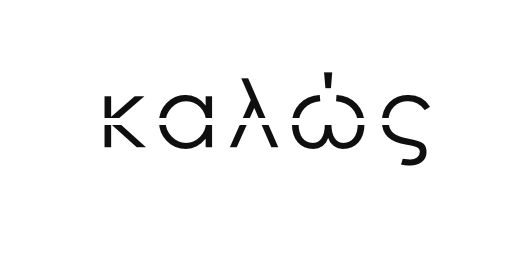

# kalos

A minimal web server framework based on NodeJS.



## Features 

- [Routing](docs/routing.md)
- [Middleware](docs/middleware.md)
- [Views](docs/view.md)
- [Event](docs/event_emitter.md)
- [Serve static files](docs/staticserving.md)
- [Authentication](docs/authentication.md)
- etc... and more


## Installation

```
npm install kalos
```

## Usage

```js
import { Server, Router } from 'kalos';

const router = new Router();

router.get('/hello', (req, res) => {
    res.send('Hello World');
});

router.get('/hello/:name', (req, res) => {
    res.send('Hello ' + req.params.name);
});

const server = new Server();
server.configRouter(router);
server.start((ip, port) => {
    console.log('Server started at: ' + ip + ':' + port);
});
```

## License

MIT @ 2019.
